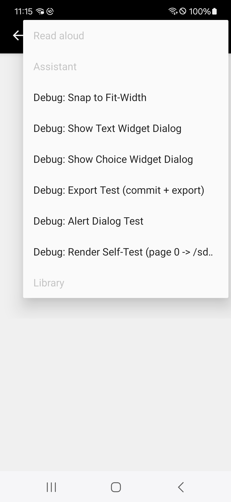
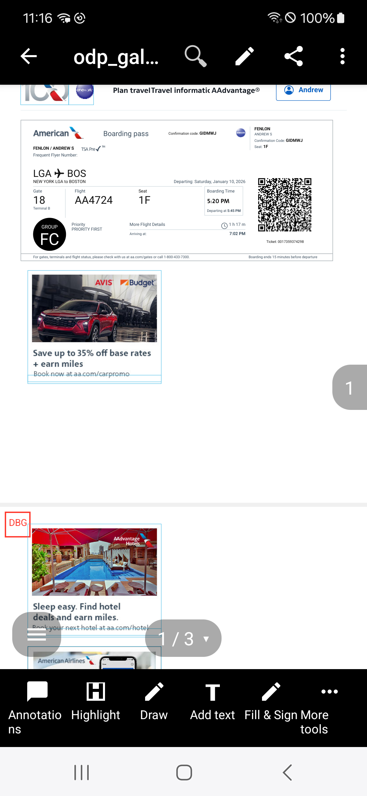
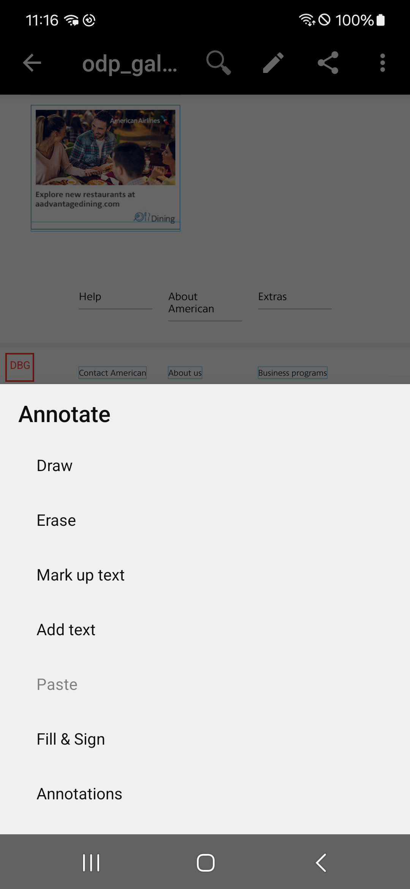
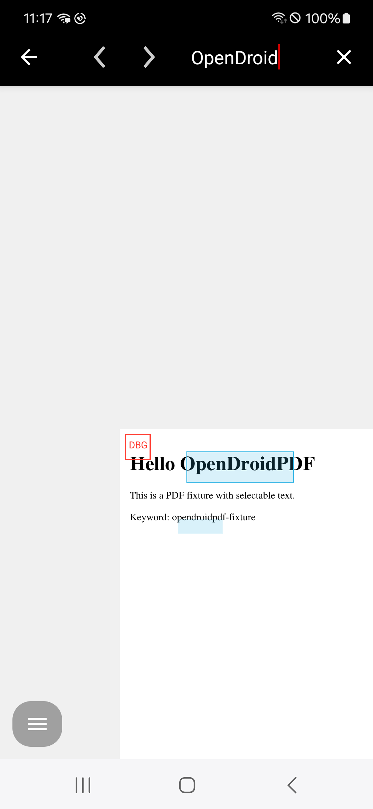
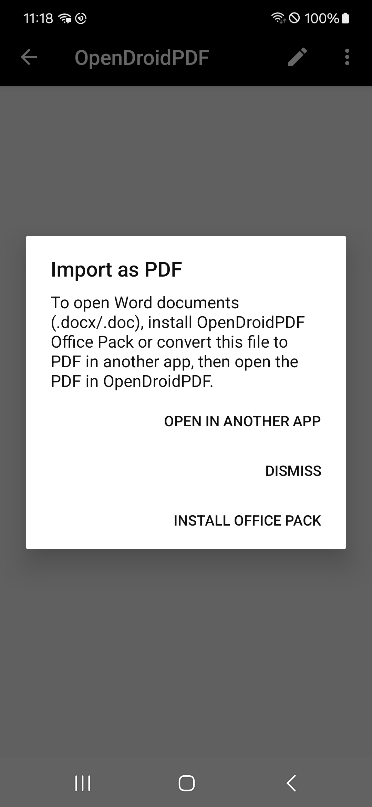
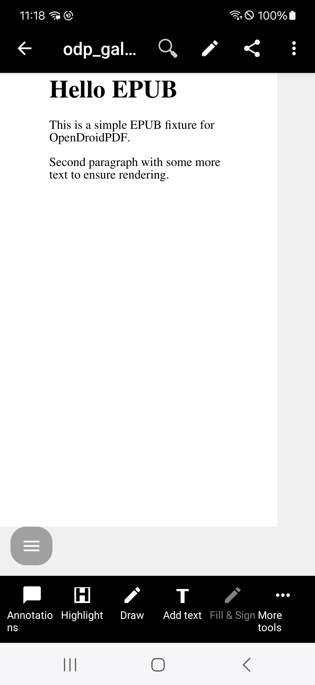

# OpenDroidPDF

OpenDroidPDF is an Android PDF viewer and annotation app built on top of MuPDF and originally forked from Christian Gogolin’s open-source Android PDF editor. OpenDroidPDF aims to make editing PDFs as easy as writing on a piece of paper while remaining fully open source under the GNU AGPLv3.

## Screenshots

  
  
  
  
  
  

- Full in-repo gallery: `docs/ui_gallery/index.html` (open locally in a browser).
- Public Device Farm upload (2026-02-09): `https://tmp.uh-oh.wtf/qa/2026/02/09/54931320-212017/d5f6e5ee-index.html`

## Building (Android)

- Prereqs: Android SDK/NDK r26+, Java 17, Gradle wrapper (bundled).
- Default debug build: `cd platform/android && ./gradlew assembleDebug`
- Release (R8 enabled): `./gradlew clean assembleRelease`
- ABI override: `./gradlew assembleRelease -Popendroidpdf.abi=arm64-v8a,armeabi-v7a`
- Build output defaults to `/mnt/subtitled/opendroidpdf-android-build`; override with `-Popendroidpdf.buildDir=/path`.
- Tests: `./gradlew connectedDebugAndroidTest` (API 30+ emulator or Genymotion).

## Download

The latest development source is available directly from the Git repository:

`git clone https://github.com/pepperpepperpepper/OpenDroidPDF.git OpenDroidPDF`

In the OpenDroidPDF directory, update the third party libraries:

`git submodule update --init`

## Reporting Bugs and Problems

OpenDroidPDF uses the GitHub issue tracker on:

`https://github.com/pepperpepperpepper/OpenDroidPDF/issues`

In case your problem is directly related to MuPDF:

- The MuPDF developers hang out on IRC in `#ghostscript` on `irc.freenode.net`.
- Report bugs on the ghostscript bugzilla, with MuPDF as the selected component: `http://bugs.ghostscript.com/`

If you are reporting a problem with PDF parsing, please include the problematic file as an attachment.

## History / Attribution

OpenDroidPDF maintains full attribution to its upstream lineage (the 2015–2016 Android PDF editor authored by Christian Gogolin and the MuPDF project). Attribution notes describe that history, but OpenDroidPDF is the only user-facing brand for this fork.

## License

OpenDroidPDF is Copyright 2025 OpenDroidPDF contributors.  
Original upstream code (2015-2016) © Christian Gogolin.

This program is free software: you can redistribute it and/or modify it under the terms of the GNU Affero General Public License version 3.0 (AGPLv3) as published by the Free Software Foundation.

This program is distributed in the hope that it will be useful, but WITHOUT ANY WARRANTY; without even the implied warranty of MERCHANTABILITY or FITNESS FOR A PARTICULAR PURPOSE. See the GNU General Public License for more details.

You should have received a copy of the GNU Affero General Public License along with this program. If not, see `<http://www.gnu.org/licenses/>`.

## Additional Notes

- Architecture/build notes: `docs/architecture.md`
- UI screenshot gallery (Device Farm): `docs/ui_gallery/index.html`
- Assistant / LLM integration: `docs/assistant_llm.md`
- PDF forms (AcroForm vs XFA): `docs/forms.md`
- Licensing text: `docs/licensing/OpenDroidPDF-License.md` (AGPLv3-only)
- Migration guidance (package rename, prefs/notes): `docs/transition.md`
- Branding assets: regenerate icons via `scripts/update_logos_from_newlogo.sh`.
